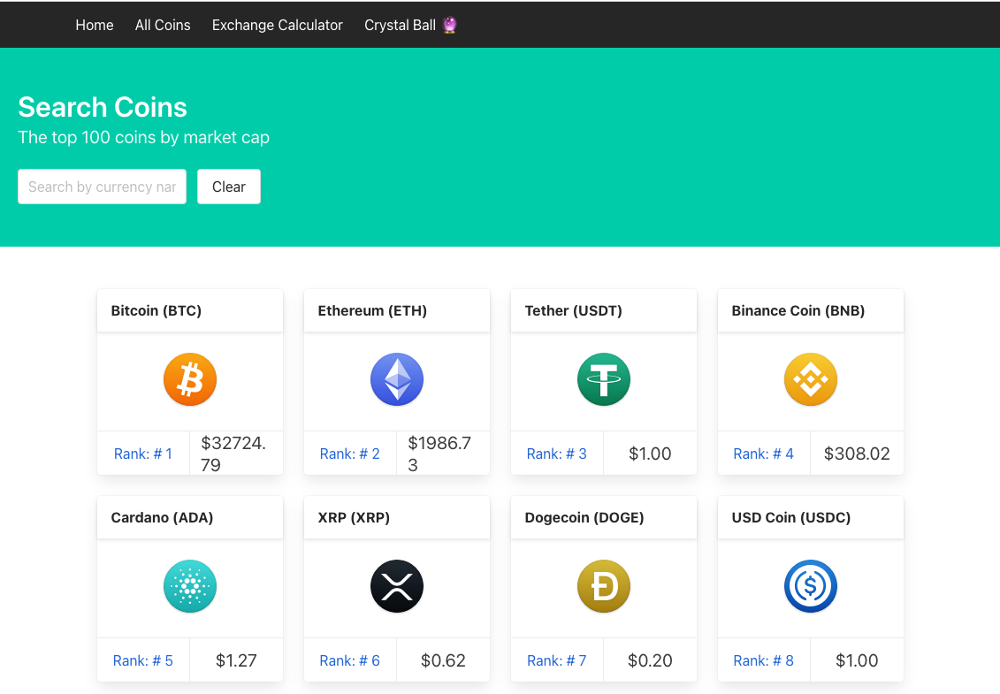
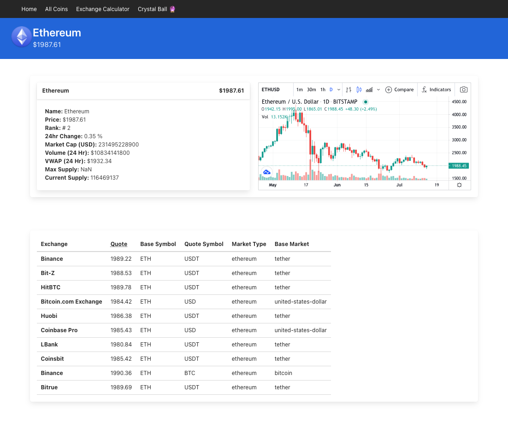
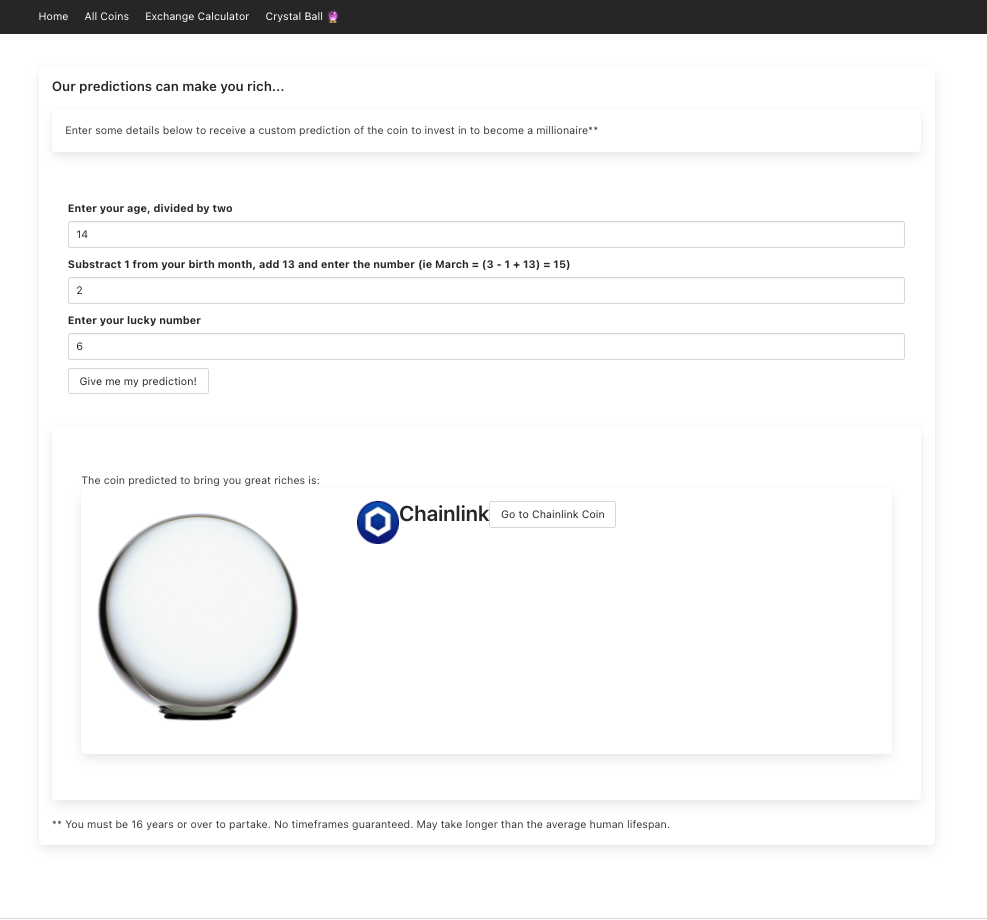

 GENERAL ASSEMBLY — SOFTWARE ENGINEERING IMMERSIVE 2021

# Crystal Crypto
## Project 2

An informational site displaying the current market value for the top 100 Crypto Currencies. The site also features an exchange calculator and a tongue-in-cheek "Crystal Ball" that tells you what currency will *surely* make a you millionaire (hence the name).

[Try it out.](https://crystal-crypto-project.netlify.app/)

For the best user experience I would recommend to look at both the coin index and the coin detail pages, and try the budget calculator as well as the "Crystal Ball".


## Authors
- Steven Saunders (waiting for Github so I can link)
- Kat Hackethal


## Table of Contents

1. [Brief](https://github.com/khackethal/sei-project-2#brief)
2. [Approach](https://github.com/khackethal/sei-project-2#brief)
   - [MVP](https://github.com/khackethal/sei-project-2#mvp)
   - [Technologies](https://github.com/khackethal/sei-project-2#technologies-frameworks-apis)
   - [Methodologies](https://github.com/khackethal/sei-project-2#methodologies)
3. [Planning](https://github.com/khackethal/sei-project-2#planning)
   - [Front End](https://github.com/khackethal/sei-project-2#front-end)
4. [Project Frames](https://github.com/khackethal/sei-project-2#project-frames)
5. [Wins & Challenges](https://github.com/khackethal/sei-project-2#wins-challenges--bugs)
6. [Key Learnings](https://github.com/khackethal/sei-project-2#key-learnings)


## Brief

Create an application with several components (at least one functional) that consumes a public API, and deploy it online. 
You can have several pages and a router if it makes sense for your application.


## Approach

### MVP

Our starting requirements were really simple, namely:
- Homepage
- Index page listing all coins
- A detail page with more information

Stretch goals were able to implement:
- Exchange calculator

Further additions:
- "Crystal Ball" feature


### Technologies/ Frameworks/ APIs

- Axios
- Bulma
- Cryptocurrency Icons
- React
- Coincap API

### Methodologies
- Write readable, simple, DRY code per KISS
- Create reusable components that have a clear, specific task 


## Planning

We understood clearly from the start that the success of our application would depend on picking a good API. We spent about a day discussing requirements. We both agreed that we wanted an API that tracks actual information and returns it in a list, with the option to zone in on details of the information. We discussed several travel APIs, but ultimately decided on Crypto Currency as it would give us the opportunity to add additional features, such as a calculator. After one attempt with a different API that did not return enough information about individual coins we found Coincap, which turned out to be ideal for what we needed.
The planning and selection process for the API is one of the key reasons we were able to exceed the deliverables.

We worked using VS Code's live share feature, which enabled us to switch between working on our assigned pages, and reviewing each other's code.


### Front End 

We worked on the Coin Index and Single Coin pages together, I then wrote the Calculator and Crystal Ball whilst Steven concentrated on inserting additional widgets into the Single Coin page and the overall styling of the app.

The calculator function is fairly simple, it asks the user to input their budget in USD and will return how many coins they can purchase of any given coin they select from a dropdown list.

```
import axios from 'axios'
import React from 'react'
import Preloader from '../preloader/Preloader'

function Calculator() {
  const [coins, setAllCoins] = React.useState(null)
  const [searchTerm, setSearchTerm] = React.useState('')
  const [budget, setBudget] = React.useState(null)
  const [selectedCoin, setSelectedCoin] = React.useState(null)
  const [coinName, setCoinName] = React.useState('')
  const [finalAmount, setFinalAmount] = React.useState(null)

  React.useEffect(() => {
    const getData = async () => {
      try {
        const response = await axios.get('https://api.coincap.io/v2/assets/')
        setAllCoins(response.data)
      } catch (err) {
        console.log(err)
      }
    }
    getData()
  }, [coins])

  const handleDropdown = (e) => {
    setSelectedCoin(e.target.value)
    setCoinName(e.target.id)
    console.log(selectedCoin, e, e.target.value, coinName)
  }

  const handleClear = () => {
    setSearchTerm('')
    setAllCoins(null)
    setBudget('')
  }

  const filteredCoins = coins?.data.filter((coin) => {
    return (
      coin.name.toLowerCase().includes(searchTerm) ||
      coin.rank.includes(searchTerm) ||
      coin.symbol.toLowerCase().includes(searchTerm)
    )
  })

  const handleInputBudget = (e) => {
    setBudget(e.target.value)
  }

  const handleCalculate = () => {
    Calculator()
  }

  function Calculator() {
    if (budget && selectedCoin) {
      const canGet = Number(budget) / Number(selectedCoin)
      setFinalAmount(canGet)
    }
  }

  return (
    <>
      <div className="container">
        <div className="section">
          <div className="box">
            <div className="title is-4">Calculator</div>
            <div className="field">
              <label className="label">Select your coin</label>
              <div className="control">
                <select onChange={handleDropdown}>
                  <option></option>
                  {filteredCoins ? (
                    filteredCoins.map((coin) => (
                      <option value={coin.priceUsd} key={coin.id}>
                        {coin.name}
                      </option>
                    ))
                  ) : (
                    <Preloader />
                  )}
                </select>
                <button className="button" onClick={handleClear}>
                  Clear
                </button>
                <h1>Enter your budget in USD $</h1>
                <input
                  className="input"
                  type="text"
                  placeholder="$ .."
                  onChange={handleInputBudget}
                />

                <button className="button" onClick={handleCalculate}>
                  Calculate!
                </button>
              </div>
            </div>
          </div>

          <div>
            {' '}
            {finalAmount
              ? `At current market rate you can buy ${finalAmount} coins of your chosen coin.`
              : ''}
          </div>
        </div>
      </div>
    </>
  )
}

export default Calculator
```

The "Crystal Ball" feature is a lot more fun, as its only aim is to generate a random coin based on several user inputs.
To add to the "prediction" feel the inputs are personalised to the user, they are being asked:

1) To enter their age, divided by two
2) Subtract 1 from their birth month, add 13, and then enter that number
3) Their lucky number

As a really low age would cause an error in the function there is a caveat on the site that you must be 16 years or older to partake.
The function also generates a random number using ```Math.random()```  to ensure the same user inputs give a different result each time for added unpredictability. The full code is shown below. 

```
import React from 'react'
import axios from 'axios'
import Preloader from '../preloader/Preloader'
import { Link } from 'react-router-dom'

function CrystalBall() {
  const [coins, setAllCoins] = React.useState(null)
  const [num1, setNum1] = React.useState(null)
  const [num2, setNum2] = React.useState(null)
  const [num3, setNum3] = React.useState(null)
  const [prediction, setPrediction] = React.useState(null)

  React.useEffect(() => {
    const getData = async () => {
      try {
        const response = await axios.get('https://api.coincap.io/v2/assets/')
        setAllCoins(response.data)
      } catch (err) {
        console.log(err)
      }
    }
    getData()
  }, [coins])

  const handleInput1 = (e) => {
    setNum1(e.target.value)
  }

  const handleInput2 = (e) => {
    setNum2(e.target.value)
  }

  const handleInput3 = (e) => {
    setNum3(e.target.value)
  }

  const handleButtonClick = () => {
    calculatePrediction()
  }

  function calculatePrediction() {
    const random = Math.floor(Math.random() * 8)
    const custom = Math.floor(Number(num1)) + Number(num2) + Number(num3)
    const predicted = custom - random
    setPrediction(predicted)
  }

  const filteredCoins = coins?.data.filter((coin) => {
    return coin.rank.includes(prediction)
  })

  return (
    <>
      <div className="section">
        <div className="container">
          <div className="box">
            <div className="title is-5">
              Our predictions can make you rich...
            </div>
            <p className="box">
              Enter some details below to receive a custom prediction of the
              coin to invest in to become a millionaire**{' '}
            </p>

            <div className="section">
              <div className="field">
                <label className="label">Enter your age, divided by two</label>
                <div className="control">
                  <p></p>
                  <input
                    className="input"
                    type="text"
                    placeholder="Your age divided by 2 .."
                    onChange={handleInput1}
                  />
                </div>
              </div>
              <div className="field">
                <label className="label">
                  Substract 1 from your birth month, add 13 and enter the number
                  (ie March = (3 - 1 + 13) = 15)
                </label>
                <div className="control">
                  <input
                    className="input"
                    type="text"
                    placeholder="Birth month minus one .."
                    onChange={handleInput2}
                  />
                </div>
              </div>
              <div className="field">
                <label className="label">Enter your lucky number</label>
                <div className="control">
                  <input
                    className="input"
                    type="text"
                    placeholder="Your lucky number.."
                    onChange={handleInput3}
                  />
                </div>
              </div>
              <div className="field">
                
                <div className="control">
                  <div className="button" onClick={handleButtonClick}>
                    Give me my prediction!
                  </div>
                </div>
              </div>

            </div>
            <div className="box">
              <div className="section">
                <p>The coin predicted to bring you great riches is:</p>
                {filteredCoins ? (
                  filteredCoins.map((coin) => (
                    
                    <div value={coin.priceUsd} key={coin.id}>
                      <div className="box crystal-ball">
                        <div className="is-flex is-horizontal-center">
                          
                          <div className="title">{coin.name}</div>
                          <Link to={`coins/${coin.id}`}>
                            <div className="button"> Go to {coin.name} Coin</div>
                          </Link>
                        </div>
                      </div>
                    </div>
                    
                    
                  ))
                ) : (
                  <Preloader />
                )}
              </div>
            </div>

            <footer>
              ** You must be 16 years or over to partake. No timeframes
              guaranteed. May take longer than the average human lifespan.
            </footer>
          </div>
        </div>
      </div>
    </>
  )
}

export default CrystalBall
```

## Project Frames

### Coin Index



### Coin Detail



### Crystal Ball


 

 ## Wins, Challenges & Bugs

### Wins

We managed to exceed deliverables on this project and had the time to add extra features and styling, which was a major win.
This was largely due to the fact we researched and picked a well suited API, but also that we managed to work out a really good workflow between us fairly quickly, alternating between coding autonomously and then checking over each other's code.

### Challenges & Bugs

This project was the first time in the course we were working in pairs, so it was an initial challenge to get used to VS Code Liveshare, and figure out the best approach between working simultaneously on the same project. We luckily managed to find a great flow fairly quickly.

There are currently are no known bugs.


### Key Learnings 

The project was a great way to get really familiar with APIs and their documentation, as the prep required us to go through quite a few possible options. It was also very useful to solidify React processes of fetching and mapping over data.
